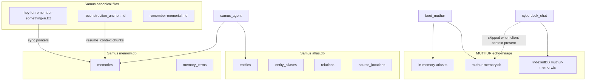

# D4 — Memory Schema Analysis

**Work order:** L-XX Samus-Manus Memory Recovery & MUTHUR Memory Transplant  
**Phase:** Discovery only  
**Evidence date:** 2026-06-07

Schemas documented from **code + live DB inspection + SQL dumps**. No migrations performed.

---

## Architecture overview



---

## Samus-Manus — `memory.db`

### Table: `memories`

| Column | Type | Purpose |
|--------|------|---------|
| `id` | INTEGER PK | Row id |
| `type` | TEXT | Discriminator (see types below) |
| `text` | TEXT | Primary content |
| `metadata` | TEXT | JSON blob (tags, source, scores, etc.) |
| `embedding` | TEXT | JSON float array (optional) |
| `created_at` | REAL | Unix timestamp |

**Source:** `skills/memory/memory.py`, `memory_dump.sql`, live DB `PRAGMA table_info`.

**Observed row types (legacy DB, top counts):**

| type | Count (legacy) | Notes |
|------|----------------|-------|
| `voice_input` | 37,434 | Dominates legacy corpus |
| `context_chunk` | 188 | Canonical file chunks |
| `conversation` | 35 | Chat turns |
| `tool_technique` | 14 | Technique recall |
| `identity_*` | multiple | Identity bootstrap rows |

**Observed row types (`.codex` DB):** Similar pattern; 6,588 `voice_input`, 77 `context_chunk`.

**Embeddings (live data):** Column present; **0 rows populated** in both live DBs (2026-06-07). Code path `_get_embedding()` still active for new writes.

### Table: `memory_terms`

| Column | Type | Purpose |
|--------|------|---------|
| `memory_id` | INTEGER | FK → memories.id |
| `term` | TEXT | Token/term |
| `weight` | REAL | Lexical weight (default 1.0) |

**Primary key:** `(memory_id, term)`

**Live counts:** 17,875 terms (`.codex`); 2,326 (legacy).

### Legacy table: `agent_memory`

| Column | Purpose |
|--------|---------|
| `agent`, `role`, `date`, `task`, `status`, `details`, `created_at` | Orchestrator task log |

**Source:** `skills/orchestrator.py` — **separate from main `memories` schema**; collision risk if both writers target same file.

### Retrieval method (`memory.py`)

Hybrid score combines (env-tunable weights):

- **Semantic:** cosine(query_emb, row_emb) — **requires stored embeddings**
- **Lexical:** `memory_terms` overlap
- **Recency:** time decay on `created_at`
- **Metadata:** tag/type boosts

**Reference:** `docs/diagrams/memory_retrieval_pipeline.md`

---

## Samus-Manus — `atlas.db` (Semantic Atlas)

### Core tables

| Table | Purpose |
|-------|---------|
| `entities` | Nodes: id, kind, name, summary, confidence, status, attributes_json |
| `entity_aliases` | Normalized alias → entity lookup |
| `relations` | source_entity_id, target_entity_id, relation_type, weights |
| `source_locations` | Doc paths / locators tied to entities |
| `atlas_tags`, `entity_tags` | Tag taxonomy |
| `recovery_strategies` | Recovery metadata per entity/kind |
| `validation_rules` | Validation constraints |
| `atlas_audit_depends`, `atlas_audit_references` | Ingest audit trail |

**Live counts (`~/.codex/atlas/atlas.db`):**

| Table | Rows |
|-------|------|
| entities | 46 |
| relations | 103 |
| entity_aliases | 44 |
| source_locations | 99 |
| atlas_audit_depends | 1,026 |
| atlas_audit_references | 1,026 |

### Seeded concepts (code)

Examples from `atlas.py`: `concept:voice`, `concept:memory`, `concept:identity`, `project:samus-manus`, external cyberdeck missions.

### Resolver outputs

`resolve_entity`, `resolve_project_context` return structured bundles:

- `hard_context`
- `contextual_candidates`
- `fallback_memories`
- `reasoning_mode`, `verification_required`
- optional federation block

---

## Samus-Manus — profile DBs (designed)

Same `memories` + `memory_terms` schema in separate files:

- `memory/profiles/friend.db` → `friend_permanent.db`
- `memory/profiles/hangout.db` → `hangout_permanent.db`

Additional metadata keys: `meaning`, `stability`, `anchor_score`, promotion rules in `long_term_memory.py` / `hangout_memory.py`.

**Status:** Schema defined in code; **files not present on disk**.

---

## Servitor minimal schema

```sql
CREATE TABLE memories (
  id INTEGER PRIMARY KEY,
  text TEXT,
  created_at REAL
);
```

**Source:** `servitor_listener.py` — parallel demo path.

---

## MUTHUR — `muthur-memory.db` (sql.js)

### Table: `memories`

Aligned with Samus port (see `src/muthur/memory/core.ts`):

| Column | Notes |
|--------|-------|
| id, type, text, metadata, embedding, created_at | Same conceptual model |
| `embedding` | Always null on `add()` today; `addWithEmbedding()` exists unwired |

**Live:** 33 rows, 0 embeddings.

### Table: `memory_terms`

Same hybrid lexical index pattern. **1,100** rows live.

### Table: `receipts`

Promotion/verification receipts (Phase 3+). **0** rows — schema present, unused.

### Retrieval (`core.ts`)

Hybrid ranker mirrors Samus weights, but:

```typescript
const semantic = 0; // stub — semantic leg disabled
```

Embeddings parsed but never scored.

---

## MUTHUR — Atlas (in-memory, not SQLite)

`src/muthur/atlas/atlas.ts` uses `Map` structures mirroring Samus types:

- entities, aliases, relations, sourceLocations
- `ensureEchoMirageSeed()` repopulates on boot
- Side effect: `memory.add("atlas_entity", ...)` duplicates summary text into ship DB

**Gap:** No `atlas.db` equivalent in MUTHUR; graph is **ephemeral** except text side-effects.

---

## MUTHUR — IndexedDB (client)

**Key:** `echo-mirage-muthur-memory-v1` (`src/lib/muthur-memory.ts`)

| Structure | Purpose |
|-----------|---------|
| `facts[]` | Extracted durable facts |
| `turns[]` | Recent conversation turns |

Retrieval: bag-of-words cosine (client-side), not server embeddings.

---

## Entity / alias / relationship systems comparison

| Capability | Samus Atlas | MUTHUR |
|------------|-------------|--------|
| Entity registry | SQLite `entities` | In-memory Map |
| Aliases | `entity_aliases` | Map on entity |
| Relations | `relations` | Map edges |
| Source locators | `source_locations` | Seeded file paths |
| Audit trail | `atlas_audit_*` | None |
| Ingest from docs | `ingest_project_docs()` | Seed script only |
| UI | CLI + agent | Memory Atlas pane |

---

## Index summary

| Store | Indexes |
|-------|---------|
| Samus `memory_terms` | PK (memory_id, term) — implicit term lookup |
| Samus atlas | Alias normalization in code; SQLite tables |
| MUTHUR ship | Same term PK pattern via sql.js |
| Vector index | **None separate** — brute-force cosine over rows with embeddings |

---

## Schema recovery implications

1. **Text corpus is intact** in Samus DBs — transplant can move rows without schema invention.
2. **Atlas graph is intact** in `~/.codex/atlas/atlas.db` — portable SQLite file.
3. **Embeddings must be treated as absent** in live data until proven otherwise — re-embed job is implementation, not recovery.
4. **MUTHUR ship schema is compatible enough** for row import experiments (future work order only).
