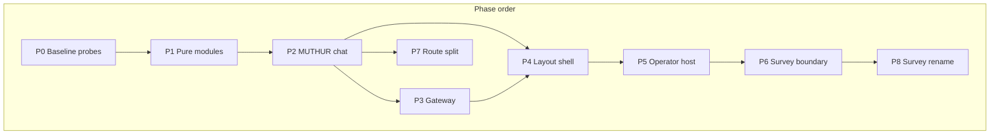

# L-CYBERDECK-001: Cyberdeck App Extraction & Compile Refactor

**Status:** Open  
**Priority:** P0 (compile / maintainability)  
**Owner:** MUTHUR / Cyberdeck  
**Era:** 2 — Bridge  
**Depends On:** [L-10 — Cyberdeck Compile Refactor Directive](../cadre/tech-lead-legislator/L-10-cyberdeck-compile-refactor-directive.md)  
**Blocks:** Survey rename cleanup (P8), operator webview handoff at scale, faster EMP dev iteration  

---

## Objective

Decompose `src/features/cyberdeck/cyberdeck-app.tsx` (~8,500 lines) into modular feature subsystems so `/cyberdeck` compile time, HMR latency, and review surface shrink without changing operator-visible behavior.

The route shell and lazy pane loaders already exist. This work order completes the extraction **inside** the app monolith and mirrors the same boundaries on `cyberdeck-chat/route.ts`.

**Non-goals (this work order):**
- Rewriting operator Monaco/workbench internals ([operator-webview-handoff.md](../operator-webview-handoff.md))
- Realmorphism port or shadcn migration
- Unrelated Survey/PowerFist feature work beyond boundary enforcement (P6) and rename cleanup (P8)

---

## Investigation Findings

| Signal | Classification | Target |
|--------|----------------|--------|
| `cyberdeck-app.tsx` ~8,493 lines (~5× next-largest file) | God component | Orchestrator ≤ ~1,200 lines |
| ~100 top-level imports in one client module | Compile graph bloat | ≤ ~35 imports in app shell |
| `handleSend` ~1,540 lines inside component | Unextracted subsystem | `use-muthur-chat-send.ts` |
| Module helpers ~720 lines before component | Low-risk wins | Pure modules under `features/cyberdeck/` |
| Pane lazy-loading done (`pane-chunks.ts`) | Partial L-10 progress | Keep; do not regress |
| Survey hooks partially extracted | Partial boundary work | `SurveyHubHost` + probe extension |
| 0 unit tests; 71 probe scripts | Test gap | Ratchet probe + pure-module tests |
| L-10 symptom: `HEAD /cyberdeck` compile ~2.8 min | Primary metric | Measure each phase |

**Verdict:** Highest yield is **P2 MUTHUR chat extraction** (`handleSend` + stream loop + chat column JSX). P1 pure-module moves are safe warm-up PRs.

---

## Architecture (target)

```text
/cyberdeck page shell (existing)
    ↓
cyberdeck-page-client.tsx (dynamic import, error boundary)
    ↓
cyberdeck-app.tsx (~800–1,200 lines — compose only)
    ├── layout/cyberdeck-layout-shell.tsx
    ├── muthur/muthur-chat-column.tsx + hooks
    ├── gateway/gateway-column.tsx + hooks
    ├── operator/operator-pane-host.tsx + hooks
    ├── survey/survey-hub-host.tsx
    └── workspace/ (custom tabs, rail, context menus)
    ↓
pane-chunks.ts → lazy pane loaders (unchanged pattern)
```



---

## Current Anatomy (`cyberdeck-app.tsx`)

| Region | Lines (approx.) | Extraction phase |
|--------|-----------------|------------------|
| Imports + `dynamic()` | 1–459 | P4 (keep minimal in app) |
| Module-level helpers | 460–1,183 | **P1** |
| State declarations | 1,185–1,700 | P2, P5 |
| Mission / delegation / posture handlers | 1,779–1,966 | **P2.5** |
| Voice / glyph / audio | 1,966–3,200 | P2 (glyph bridge) / existing hooks |
| Operator document surface | 3,195–4,000 | **P5** |
| Tabs / providers / persistence | 4,000–5,400 | **P3** |
| `handleSend` + stream loop | 5,410–6,949 | **P2.3** |
| PowerFist deck socket effect | 6,900–6,947 | **P6** |
| Drag/drop + context menus | 7,063–7,700 | **P4.3** |
| `renderCustomTabPane` | 7,700–8,015 | **P4.2** |
| JSX return (layout + panes) | 8,016–8,089 | **P4.1**, P2.4, P3.2 |

---

## Phased Deliverables

### P0 — Baseline & guardrails (1 PR)

| ID | Deliverable | Path | Status |
|----|-------------|------|--------|
| D0.1 | Compile-scope probe (import graph / line-count ratchet) | `scripts/probe-cyberdeck-compile-scope.ts` | Done |
| D0.2 | npm script | `package.json` → `probe:cyberdeck-compile-scope` | Done |
| D0.3 | Baseline metrics in PR / verification doc | `docs/verifications/JP-L-CYBERDECK-001-P0.md` | Done (awaiting verifier) |

**Verifier brief:** [VERIFY-L-CYBERDECK-001-P0](../verifications/VERIFY-L-CYBERDECK-001-P0.md)

**Rules for all subsequent PRs:** one subsystem per PR; `tsc --noEmit`; listed probes; record `HEAD /cyberdeck` compile time when possible.

**Independent verification:** Each phase must be reviewed by a separate agent using [VERIFY-L-CYBERDECK-001](../verifications/VERIFY-L-CYBERDECK-001.md) and the phase brief (`VERIFY-L-CYBERDECK-001-P0.md`, etc.). Judicial receipt: `JP-L-CYBERDECK-001-P*.md`.

**Execution & conduction:**

| Role | Document |
|------|----------|
| Tech lead / conductor | [L-CYBERDECK-001-CONDUCTOR](./L-CYBERDECK-001-CONDUCTOR.md) |
| Developer (Executive) | [E-CYBERDECK-001-extraction-execution](../cadre/executive-coder/E-CYBERDECK-001-extraction-execution.md) |
| Tester / judge | [VERIFY-L-CYBERDECK-001-TESTER](../verifications/VERIFY-L-CYBERDECK-001-TESTER.md) |

---

### P1 — Pure module extraction (2–3 PRs, no behavior change)

| ID | Deliverable | New path |
|----|-------------|----------|
| D1.1 | Custom tab model + `parseCustomTabCommand` | `src/features/cyberdeck/workspace/custom-tab-model.ts` |
| D1.2 | Server rail config (`servers`, `safeServerId`, `SERVER_IDS`) | `src/features/cyberdeck/workspace/server-rail-config.ts` |
| D1.3 | Gateway message render helpers | `src/features/cyberdeck/gateway/gateway-message-render.tsx` |
| D1.4 | Coding verify format helpers | `src/features/cyberdeck/muthur/coding-verify-format.ts` |
| D1.5 | Operator drop utils + `DroppedOperatorAsset` | `src/features/cyberdeck/operator/operator-drop-utils.ts` |
| D1.6 | Shared UI utils (`textForSpeech`, context menu target) | `src/features/cyberdeck/shared/cyberdeck-ui-utils.ts` |
| D1.7 | `buildCyberdeckChatHistory` | `src/features/cyberdeck/muthur/build-chat-history.ts` |

**Line budget after P1:** `cyberdeck-app.tsx` ≤ ~7,600.

---

### P2 — MUTHUR chat subsystem (4–5 PRs, highest compile win)

| ID | Deliverable | New path |
|----|-------------|----------|
| D2.1 | Chat state hook (`messages`, diagnostics, stream flags) | `src/features/cyberdeck/muthur/use-muthur-chat-state.ts` |
| D2.2 | Chat types + storage keys | `src/features/cyberdeck/muthur/muthur-chat-types.ts` |
| D2.3 | Send intent routing (clear, help, atlas, glyph, survey connect) | `src/features/cyberdeck/muthur/muthur-send-intents.ts` |
| D2.4 | Send intent hook | `src/features/cyberdeck/muthur/use-muthur-send-intents.ts` |
| D2.5 | Chat client (fetch `/api/cyberdeck-chat`, SSE, abort/steer) | `src/lib/muthur-core/muthur-chat-client.ts` |
| D2.6 | `handleSend` / `handleStop` hook | `src/features/cyberdeck/muthur/use-muthur-chat-send.ts` |
| D2.7 | Chat column UI shell | `src/features/cyberdeck/muthur/muthur-chat-column.tsx` |
| D2.8 | Commander handlers (posture, mission, delegation) | `src/features/cyberdeck/muthur/use-muthur-commander-handlers.ts` |
| D2.9 | Cognition bridge hook | `src/features/cyberdeck/muthur/use-muthur-cognition-bridge.ts` |

**Line budget after P2:** `cyberdeck-app.tsx` ≤ ~4,800; `handleSend` removed from app file.

**Existing hooks to preserve:** `use-survey-muthur-archive.ts`, `use-survey-muthur-mission-handlers.ts`, `use-muthur-chat-auto-scroll.ts`.

---

### P3 — Gateway / provider column (2 PRs)

| ID | Deliverable | New path |
|----|-------------|----------|
| D3.1 | Provider connection hook | `src/features/cyberdeck/gateway/use-provider-connection.ts` |
| D3.2 | Provider pane state | `src/features/cyberdeck/gateway/provider-pane-state.ts` |
| D3.3 | Gateway column host | `src/features/cyberdeck/gateway/gateway-column.tsx` |

Reuse: `src/components/cyberdeck/cyberdeck-pane-slots.tsx`.

**Line budget after P3:** ≤ ~3,900.

---

### P4 — Layout & workspace shell (2–3 PRs)

| ID | Deliverable | New path |
|----|-------------|----------|
| D4.1 | Resizable layout shell | `src/features/cyberdeck/layout/cyberdeck-layout-shell.tsx` |
| D4.2 | Mobile layout hook | `src/features/cyberdeck/layout/use-mobile-cyberdeck-layout.ts` |
| D4.3 | Custom tab pane renderer | `src/features/cyberdeck/workspace/custom-tab-pane-renderer.tsx` |
| D4.4 | Custom tab browser hook | `src/features/cyberdeck/workspace/use-custom-tab-browser.ts` |
| D4.5 | Context menus component | `src/features/cyberdeck/workspace/cyberdeck-context-menus.tsx` |
| D4.6 | Rail tab context menu hook | `src/features/cyberdeck/workspace/use-rail-tab-context-menu.ts` |

**Line budget after P4:** `cyberdeck-app.tsx` ≤ ~2,500 (orchestrator + wiring).

---

### P5 — Operator orchestration (2 PRs)

| ID | Deliverable | New path |
|----|-------------|----------|
| D5.1 | Operator workspace state hook | `src/features/cyberdeck/operator/use-operator-workspace-state.ts` |
| D5.2 | Operator drag/drop hook | `src/features/cyberdeck/operator/use-operator-drag-drop.ts` |
| D5.3 | Operator pane host | `src/features/cyberdeck/operator/operator-pane-host.tsx` |
| D5.4 | Operator host context (reduce prop drilling) | `src/features/cyberdeck/operator/operator-pane-host-context.tsx` |

**Constraint:** Move wiring only — do not refactor Monaco/workbench internals.

---

### P6 — Survey / PowerFist boundary (2 PRs)

| ID | Deliverable | New path |
|----|-------------|----------|
| D6.1 | Survey hub host (mount `SurveyAutoPairHost`, tab lifecycle) | `src/features/cyberdeck/survey/survey-hub-host.tsx` |
| D6.2 | PowerFist deck socket hook | `src/features/cyberdeck/survey/use-powerfist-deck-socket.ts` |
| D6.3 | Extend boundary probe — forbid `powerfist-remote-socket` in `cyberdeck-app.tsx` | `scripts/probe-survey-connect-boundary.ts` |

Aligns with [`survey-boundary.ts`](../../src/lib/cyberdeck/survey-boundary.ts) rule 5 and [`docs/survey-emp-backends.md`](../survey-emp-backends.md).

---

### P7 — Server route split (2–3 PRs, parallel after P2)

| ID | Deliverable | New path |
|----|-------------|----------|
| D7.1 | Posture / self-modify preamble | `src/lib/muthur/chat/muthur-chat-posture.ts` |
| D7.2 | Tool round loop | `src/lib/muthur/chat/muthur-chat-tool-round.ts` |
| D7.3 | Stream handler | `src/lib/muthur/chat/muthur-chat-stream-handler.ts` |
| D7.4 | Thin route delegator | `src/app/api/cyberdeck-chat/route.ts` (≤ ~150 lines) |
| D7.5 | (Optional) Survey analyze pipeline | `src/lib/server/survey-analyze-pipeline.server.ts` |

Source: `src/app/api/cyberdeck-chat/route.ts` (~766 lines today).

---

### P8 — Survey / PowerFist rename cleanup (3–4 PRs, after P6 stable)

| ID | Deliverable |
|----|-------------|
| D8.1 | Remove `@deprecated` `PowerfistMission*` aliases; use `SurveyMission*` only |
| D8.2 | Rename `powerfist-remote-socket.ts` → `survey-hub-socket.ts` (one-release re-export shim) |
| D8.3 | Delete `powerfist-deck-embed.tsx`, `load-cyberdeck-pane.ts` |
| D8.4 | Remove legacy pairing UI behind `isSurveyLegacyPairingEnabled()` |

---

## Target Directory Tree (end state)

```text
src/features/cyberdeck/
  cyberdeck-app.tsx                 # compose only
  cyberdeck-page-client.tsx
  pane-chunks.ts / pane-registry.ts
  layout/
  muthur/
  gateway/
  operator/
  survey/
  workspace/
  shared/
  hooks/                            # existing survey hooks
src/lib/muthur/chat/                # P7 server modules
```

---

## PR Sequence (recommended)

| Order | Phase | PR title (suggested) |
|------:|-------|----------------------|
| 1 | P0.1 | `chore: cyberdeck compile-scope baseline probe` |
| 2 | P1.1 | `refactor: extract custom tab model from cyberdeck-app` |
| 3 | P1.2 | `refactor: extract gateway helpers from cyberdeck-app` |
| 4 | P1.3 | `refactor: extract operator drop utils from cyberdeck-app` |
| 5 | P2.1 | `refactor: muthur chat state hook` |
| 6 | P2.2 | `refactor: muthur send intent routing` |
| 7 | P2.3 | `refactor: extract handleSend to use-muthur-chat-send` |
| 8 | P2.4 | `refactor: muthur chat column component` |
| 9 | P2.5 | `refactor: muthur commander handlers hook` |
| 10 | P3.1–P3.2 | `refactor: gateway column extraction` |
| 11 | P4.1–P4.3 | `refactor: layout shell and workspace chrome` |
| 12 | P5.1–P5.2 | `refactor: operator pane host` |
| 13 | P6.1–P6.2 | `refactor: survey hub host + boundary probe` |
| 14 | P7.1 | `refactor: split cyberdeck-chat route` |
| 15 | P8.* | `chore: survey/powerfist rename cleanup` |

---

## Key Files (touch list)

**Primary monolith:**
- `src/features/cyberdeck/cyberdeck-app.tsx`

**Already extracted (do not break):**
- `src/features/cyberdeck/pane-chunks.ts`
- `src/features/cyberdeck/hooks/use-survey-muthur-archive.ts`
- `src/features/cyberdeck/hooks/use-survey-muthur-mission-handlers.ts`
- `src/app/cyberdeck/cyberdeck-page-client.tsx`

**Boundary / probes:**
- `src/lib/cyberdeck/survey-boundary.ts`
- `scripts/probe-survey-connect-boundary.ts`
- `scripts/probe-survey-hub-functional.ts`
- `scripts/probe-cyberdeck-compile-scope.ts` (P0)

**MUTHUR (must stay green through P2):**
- `src/lib/muthur-core/muthur-response-channel.ts`
- `src/lib/muthur-core/muthur-diagnostics-channel.ts`
- `src/components/cyberdeck/muthur-command-console-log.tsx`

**Directive reference:**
- `docs/cadre/tech-lead-legislator/L-10-cyberdeck-compile-refactor-directive.md`

---

## Tests & Verification

### Per-PR minimum

```powershell
pnpm exec tsc --noEmit
pnpm probe:cyberdeck-compile-scope    # after P0
```

### Phase-specific probes

| Phase | Probes |
|-------|--------|
| P2 | `pnpm probe:muthur-command-console`, `pnpm probe:muthur-response-visibility`, `pnpm probe:muthur-posture` |
| P5 | `pnpm probe:operator-file-surface` |
| P6 | `pnpm probe:survey-hub`, `pnpm probe:survey-connect-boundary` |
| P7 | `pnpm probe:muthur-command-console` (indirect route coverage) |
| P8 | `pnpm probe:survey-hub` + EMP manual smoke |

### Manual smoke (every phase touching UI)

1. Open `/cyberdeck` — boot + rail render
2. Send MUTHUR message — stream complete, diagnostics accordion
3. Switch operator tab — open/save document
4. Survey Hub connect (if P6 touched)

### Success metrics (ratchet)

| Metric | Baseline | After P2 | After P4 | Final |
|--------|----------|----------|----------|-------|
| `cyberdeck-app.tsx` lines | ~8,493 | ≤ 4,800 | ≤ 2,500 | ≤ 1,200 |
| Top-level imports in app | ~100 | ≤ 60 | ≤ 35 | ≤ 35 |
| `HEAD /cyberdeck` compile | ~2.8 min (L-10) | measure | measure | measure |
| Pure module unit tests | 0 | +5 | +10 | +15 |

---

## Risk Register

| Phase | Risk | Mitigation |
|-------|------|------------|
| P2 | Stream / tool trace / reasoning / diagnostics regression | L-UI-001 probes; manual steer-abort |
| P2 | Circular imports (muthur ↔ operator) | Intent module with injected callbacks |
| P4 | Custom tab browser / idb key drift | Do not rename storage keys |
| P5 | Operator save path breaks | Context optional; one PR prop fallback |
| P6 | PowerFist missions stop | `probe:survey-hub` gate |
| P8 | Echo Satellite API path breaks | Keep route aliases one release |

---

## Acceptance Criteria (work order close)

- [ ] `cyberdeck-app.tsx` ≤ 1,200 lines; imports ≤ 35
- [ ] All P0–P7 deliverables merged or explicitly deferred with legislator note
- [ ] `pnpm probe:cyberdeck-compile-scope` passes with ratchet thresholds
- [ ] MUTHUR probes green (`probe:muthur-command-console`, `probe:muthur-response-visibility`)
- [ ] Survey boundary probe green after P6
- [ ] Documented compile time improvement vs L-10 baseline in `docs/verifications/JP-L-CYBERDECK-001.md`
- [ ] P8 may close as follow-on work order if rename scope is split

---

## Constitutional Notes

- **No unrelated refactors** per L-16 / J-16 execution contract
- **Operator tab:** wiring extraction only ([operator-webview-handoff.md](../operator-webview-handoff.md))
- **Executive thread:** implementation evidence lives in PRs; judicial receipt in `docs/verifications/JP-L-CYBERDECK-001*.md` per phase

---

## Related Documents

| Document | Role |
|----------|------|
| [L-10 Cyberdeck Compile Refactor Directive](../cadre/tech-lead-legislator/L-10-cyberdeck-compile-refactor-directive.md) | Parent directive |
| [L-UI-001 Response Visibility](./L-UI-001-response-visibility.md) | MUTHUR channel invariants (must not regress) |
| [survey-boundary.ts](../../src/lib/cyberdeck/survey-boundary.ts) | Transport + import rules |
| [survey-emp-backends.md](../survey-emp-backends.md) | Go sidecar flip (orthogonal to this WO) |
| [operator-webview-handoff.md](../operator-webview-handoff.md) | Operator refactor guardrail |
